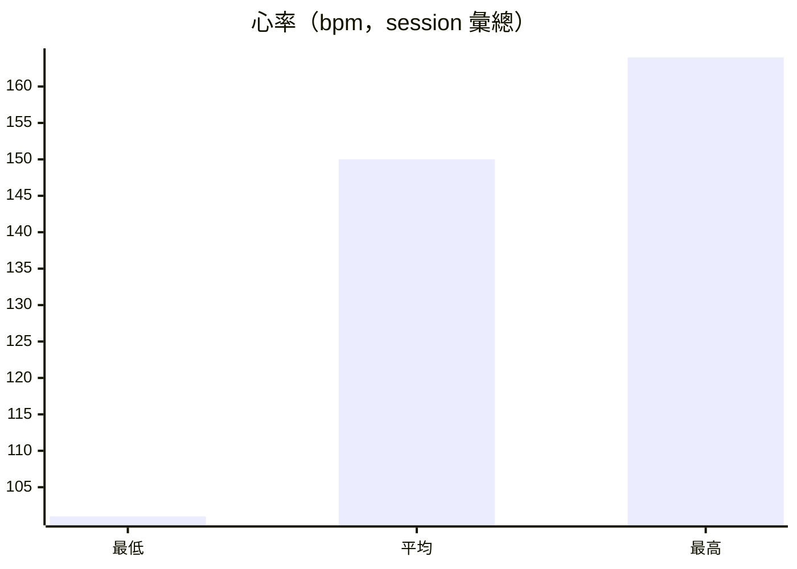

# 單次活動分析：`20260420212928.fit`

**活動時間（Asia／Taipei，UTC+8）**：2026-04-20 21:29:28+08:00 → 2026-04-20 22:09:58+08:00（與 `sessions_summary.json` 該列 `activity_window_utc8` 一致；對應 FIT `session` 之 `start_time`／`timestamp` 為 UTC。）

**裝置／檔案**：COROS PACE 4；`data/20260420212928.fit`。

---

## 現況摘要

### 主要 session 欄位

| 項目 | 數值 |
|------|------|
| 運動類型 | running |
| 計時時間 | 2429.85 s（`total_timer_time`／`total_elapsed_time` 同值） |
| 距離 | 5301.82 m |
| 卡路里 | 417 |
| 心率（低／均／高） | 101／150／164 bpm |
| 速度（均／高） | 2.182／3.195 m/s（`avg_speed`／`enhanced_max_speed`） |
| 均溫（感測） | 29 |
| 爬升／下降 | 0／6 m |
| 平均功率 | 148 |
| 步頻／步幅／strides | `total_strides` 3179；`avg_running_cadence` 80；`max_running_cadence` 94；`avg_step_length` 820.0（單位依檔案定義） |
| 觸地時間（均） | 276.0 |
| 觸地平衡（均） | 0.0 |
| 垂直振幅（均） | 90.0 |
| 垂直比（均） | 10.6 |
| Effort Pace（欄位字串） | 2.183000087738037 |

### 心率低／均／高（視覺化，數值僅來自上表）

---

## 教練建議

- 本次為 **約 2429.85 s、5301.82 m** 的 **running**，平均心率 **150 bpm**、最高 **164 bpm**，與 **平均速度 2.182 m/s** 一併觀察，屬以檔案內 session 彙總可讀出的單次負荷描述；若你主觀疲勞與此不符，應以身體感受為準。
- **步頻 80、步幅 820.0、垂直比 10.6、垂直振幅 90.0** 皆為手錶回報之跑步型態指標；是否在個人舒適區，需搭配影片或教練現場觀察，無法僅由單次彙總斷定「好／壞」。
- **爬升 0 m、下降 6 m** 顯示路線起伏不大；若同日另有訓練或工作久站，仍應把全日疲勞一併納入隔日課表調整。

---

## 細部說明

- **檔案識別**（`file_id`）：製造商 coros；`time_created` 2026-05-02 09:03:09+00:00；`product` 806；`product_name` COROS PACE 4。此為檔案 metadata，與活動起迄時間不同欄位來源。
- **速度欄位**：`max_speed` 與 `enhanced_max_speed` 皆為 3.195；`avg_speed` 與 `enhanced_avg_speed` 皆為 2.182；本表已引用，不另推估配速換算，以免與裝置顯示定義不一致。
- **資料限制與免責**：本頁僅根據 `coach-parse --json` 產出之 `session.json` 結構化欄位撰寫，無逐秒軌跡、無睡眠／HRV 等未出現在該 JSON 之資訊。**非醫療建議、非診斷**；傷痛或心血管不適應尋求合格專業協助。
