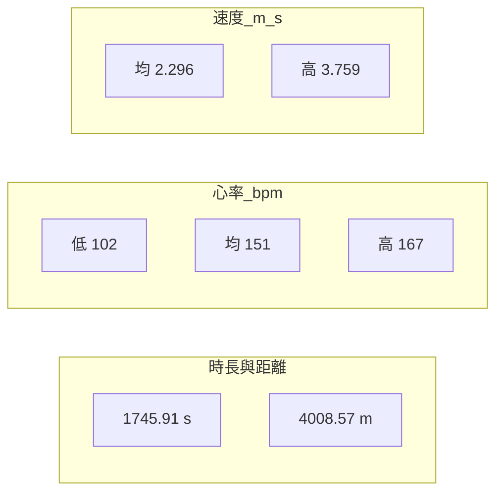

# 單次活動分析：20260422211948_01

**資料來源**：`data/20260422211948_01.fit`（`coach-parse --json` 之 session 彙總）。以下數字皆出自該次解析結果；無逐秒軌跡，推論處會標示為假設。

**活動時間（Asia／Taipei，UTC+8）**：2026-04-22 21:19:48+08:00 → 2026-04-22 21:48:54+08:00（與 `sessions_summary.json` 之 `activity_window_utc8` 一致）

**裝置**：COROS PACE 4（`file_id.product_name`）

---

## 現況摘要

### 主表（session 欄位）

| 項目 | 數值 |
|------|------|
| 運動類型 | running |
| 總經過時間／計時 | 1745.91 s |
| 總距離 | 4008.57 m |
| 卡路里 | 332 |
| 心率（低／均／高） | 102／151／167 bpm |
| 平均速度／最高速度 | 2.296／3.759 m/s |
| 平均功率 | 159 W |
| 總步數（strides） | 2357 |
| 平均／最高步頻（running cadence） | 81／92（FIT 欄位照錄，單位依裝置定義） |
| 平均步幅 | 850.0 mm |
| 平均觸地時間 | 269.0 ms |
| 平均垂直振幅 | 92.0 mm |
| 平均垂直比 | 10.4 % |
| 觸地平衡（avg_stance_time_balance） | 0.0 |
| 平均溫度 | 30（單位依 FIT，此處照錄） |
| 總爬升／下降 | 15／19 m |
| Effort Pace（檔案欄位） | 2.319999933242798 |

### 時間軸（視覺化彙總，數值同表）

---

## 教練建議

你這次在台北晚上時段跑了 **1745.91 s**、距離 **4008.57 m**（皆出自 session），整體看起來像一趟**時間相對表內其他檔案較短、但平均心率與最高心率數值都偏高**的有氧跑：平均心率 151、最高到 167；若以「輕鬆跑」當目標，當天狀態、配速或環境（氣溫欄位顯示平均 30）都可能拉高心血管負擔，**實際原因需搭配你主觀感受**，此處不代為斷定。

平均速度 2.296 m/s、最高 3.759 m/s，代表你後段或某些段落有明顯加速；若你主觀感受是「喘但還能講短句」，那比較像**穩健有氧偏上**；若已經很喘、講話困難，那就更接近**閾值附近**。我這邊沒有 RPE 或逐公里分段，所以**不替你下結論**，只說：數字顯示這次強度不低，下次若要「恢復跑」，可以刻意把平均心率目標往下調一點、或把最高速的段落縮短。

步頻與步幅（平均 cadence 81、步幅 850 mm、觸地約 269 ms）是裝置彙總值；若你覺得落地偏重，可以從「小步快頻、輕落地」慢慢試，但不必為了追數字一次改太多——**以你跑完隔天的疲勞感與膝踝回饋為準**。

`avg_stance_time_balance` 為 0.0 時，有時代表裝置未提供左右平衡或欄位未寫入；若要談左右對稱，需要其他證據，這邊先當成**未知／參考性低**。

---

## 補充觀點

- **與同 repo 其他次彙總比較**（僅能從各次 session 表層數字對照，無週總量）：這次的計時 1745.91 s 與距離 4008.57 m 在歷史表中是較短的一趟；平均心率 151、最高心率 167 在表列幾次中屬於心率負擔較高的一側。解讀時請保留空間：可能當天狀態、睡眠、氣溫、前幾天訓練量都會影響，**不是單一數字就能定義好壞**。
- **爬升／下降**（15 m／19 m）數值不大，路線起伏可能不是主因，但仍可能對配速與心率有小幅影響。
- **非醫療、非診斷**：若胸悶、暈眩、異常心悸或不適，請優先尋求合格醫療／專業人員協助；本報告僅根據單次 FIT 彙總欄位討論訓練感受與方向，**不能**取代醫學評估。

---

**資料限制**：本檔為 session 層級彙總，無逐秒心率／配速曲線；深度圖表若需自行比對，請以裝置原始紀錄或匯出為準。
